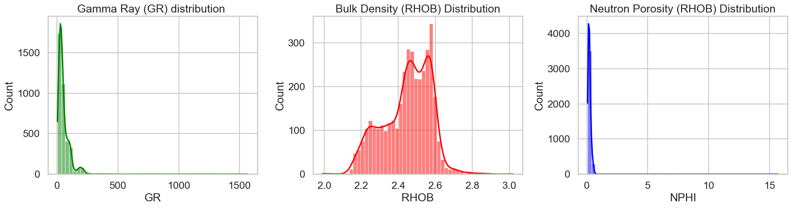
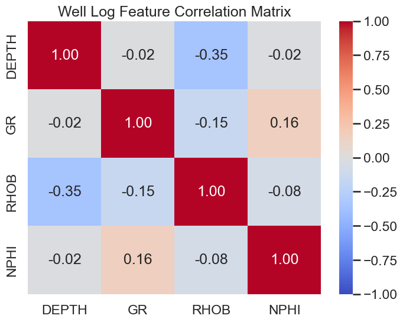
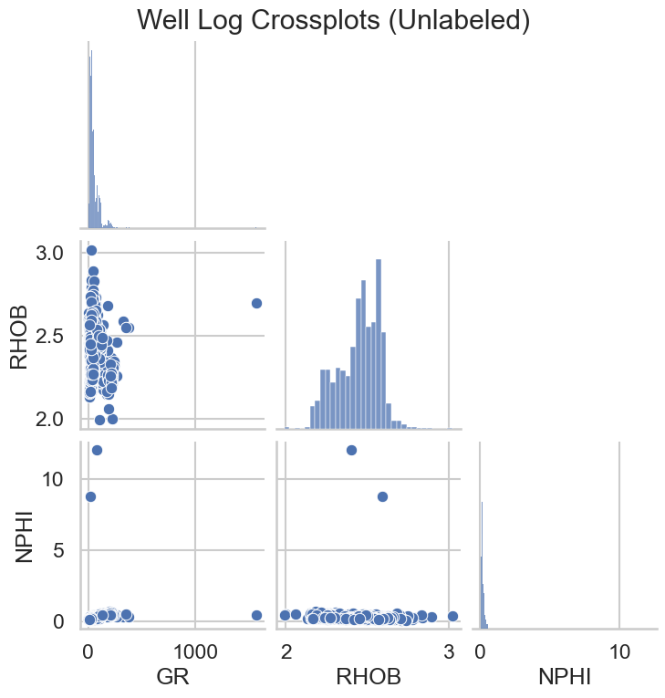
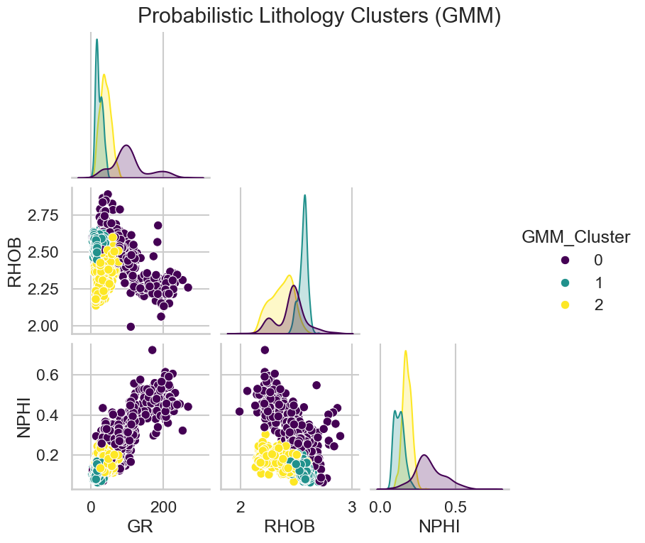
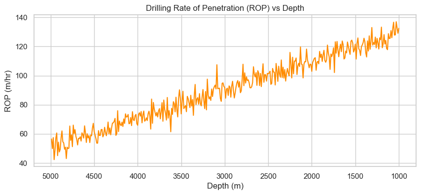
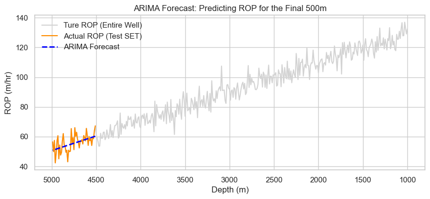
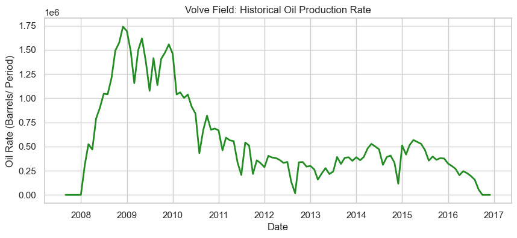
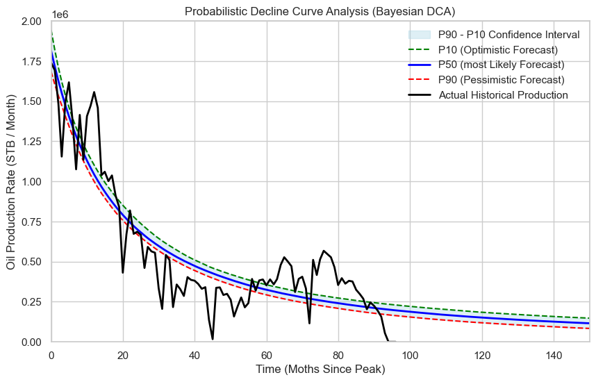

# Volve Field Subsurface Data Science Workflow

This repository contains a full cycle subsurface data science project utilizing the open source Volve Field dataset. The workflow is split into three main technical domains: petrophysical lithology clustering, drilling rate of penetration forecasting, and probabilistic decline curve analysis.

### 1. Well Log Data Analysis and Lithology Clustering

Engineers must classify rock types to accurately assess reservoir quality. The analysis begins by mapping the individual distributions of Gamma Ray, Bulk Density, and Neutron Porosity. These histograms reveal skewed distributions and multiple modes, which indicates the presence of varying rock formations. The correlation matrix utilizes Pearson correlation coefficients, and the crossplots quantify linear relationships, allowing us to spot underlying petrophysical patterns between the logging tools. To automate this rock classification, an unsupervised Gaussian Mixture Model is applied, which evaluates the covariance and probability density of the multivariate data. The algorithm groups the data into three distinct probabilistic clusters, successfully isolating three unique lithological facies without requiring manual interpretation.

### 2. Drilling Rate of Penetration Forecasting

Predicting drilling speed helps optimize rig time and reduce operational costs. The first graph evaluates the historical Rate of Penetration against well depth, showing how the drilling pace changes as the drill bit moves deeper. After loading 112 rows of data, an ARIMA time series model, which applies autoregressive lags and moving average differencing to achieve data stationarity, is deployed to predict drilling speeds for the final 500 meters of the wellbore. The forecast successfully tracks the actual test set, achieving a Root Mean Squared Error of 4.943 meters per hour.

### 3. Probabilistic Decline Curve Analysis

Estimating ultimate recovery is vital for reservoir asset management. We first plot the historical oil production rate to visualize the life cycle of the well. To forecast future production, the decline phase has been sliced, isolating 97 months of decline data to model. A Bayesian decline curve analysis leverages Markov Chain Monte Carlo sampling to calculate the optimal Arps parameters: qi = 1820188, b = 0.700, and di = 0.057. Following this, a Monte Carlo simulation is complete. The probabilistic P10 optimistic, P50 most likely, and P90 pessimistic confidence intervals are successfully generated and plotted against the actual historical production data. This provides a rigorous, risk quantified production forecast based on posterior probability distributions compared to traditional deterministic methods.
